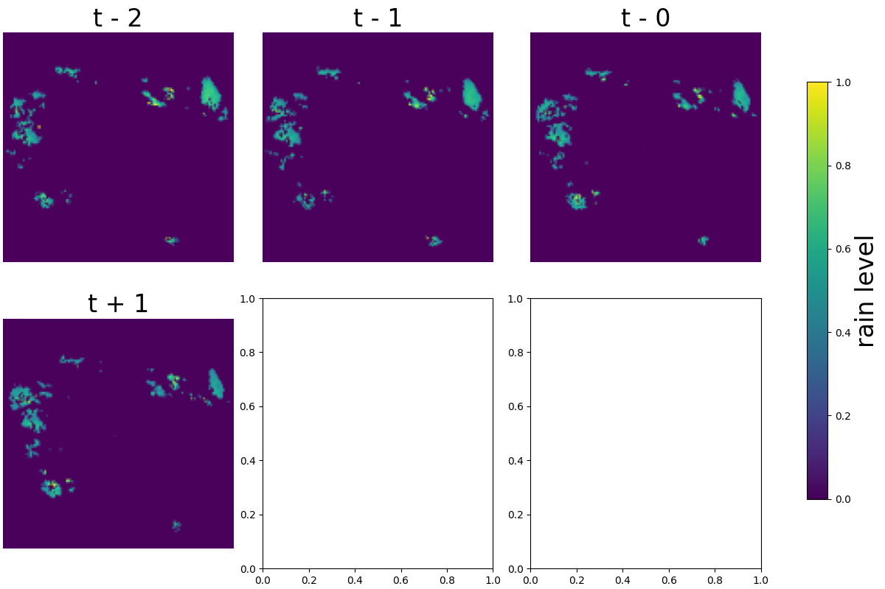

## Citation

I attempted to implement the model from the paper below. This is not the official code of the paper and is only for reference purposes
```bibtex
@article{kaparakis2023wfunet,
  title={RainPredRNN: A New Approach for Precipitation Nowcasting with Weather Radar Echo Images Based on Deep Learning},
  year={2022},
  archivePrefix={arXiv},
  primaryClass={cs.LG}
}
